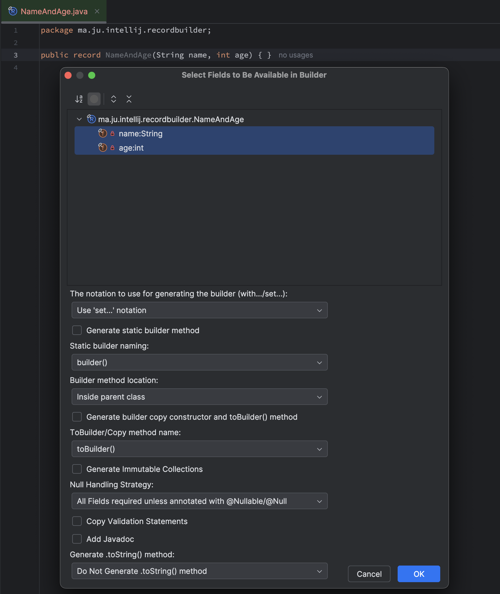

RecordBuilder is an [IntelliJ IDEA](https://www.jetbrains.com/idea/) [plugin](https://plugins.jetbrains.com/plugin/24331-record-builder) for generating an inline "Builder"
pattern code for Java records, POJO's and Interfaces.

The plugin compatibility is declared to be for any version of IDEA from 
`2023.3.` forward.

When written, the plugin was targeted at IDEA `2023.3.3` and thus assumes
you will use JDK 17 SDK to build and run it.



# Functionality

# Usage guide

1. **Open the Generate Menu**:

* Navigate to `/ Code / Generate...` or use the shortcut `Alt + Insert`.


2. **Select Create Builder...**:

* From the popup list, choose `Create Builder...`.


3. **Customize Your Builder**:

* A dialog appears allowing field selection and Options Confirm to generate the builder
  pattern.

# Options 

| Config                                                     | Description                                                                                                                                                                            |
|------------------------------------------------------------|----------------------------------------------------------------------------------------------------------------------------------------------------------------------------------------|
| Builder Notation                                           | The prefix to use for the builder setter methods. Either `get`, `with` or no prefix similar to record method names                                                                     |
| Generate Static Builder Method                             | Whether to generate a static builder method. If not set, the generated builder will have a public constructor                                                                          |
| Static Builder Name                                        | The name to use for the static builder method. Either `builder()`. `newBuilder()`, `new[ClassName]()` `a[ClassName]()`, `new[ClassName]Builder()`                                      |
| Static Builder Method Location                             | Where the static builder method should be located, either in the `parent class` or inside the `generated builder` itself                                                               |
| Generate builder copy constructor and `toBuilder()` method | Generate a copy method on the parent class that creates a builder from itself                                                                                                          |
| Copy Method Name                                           | The name of the copy method `copy()` `but()` or `toBuilder()`                                                                                                                          |
| Generate Immutable Collections                             | Force all collections `List, Set, Map` into immutable types using the `copyOf` method of the type                                                                                      |
| Null Handling Strategy                                     | How to deal with nulls, `Assume all fields required unless annotated with @Nullable or @Null` or `Assume all fields optional unless annotated with @NotNull/ @NonNull` or `Do Nothing` |
| Copy Validation Statements                                 | For records copy the `validate()` method in the builder into the canonical constructor                                                                                                 |
| Add JavaDoc                                                | Add JavaDoc to the generated builder methods                                                                                                                                           |
| Generate `.toString()` method                              | Generate a `toString()` method for the parent class. Can either generate a pretty to string or a generic one                                                                           |


# Guide 

## How do I...
*   ... [use **nullable** properties?](#nullable)
*   ... [perform other **validation**?](#validate)
*   ... [use a property of a **mutable** type?](#mutable_property)

## <a name="nullable"></a>... use nullable properties?
The generated constructor will reject any null values. If you want to accept null, simply apply any annotation 
named either @Nullable / @Null to the appropriate field. This causes the Builder to remove the null checks. The source
of the annotation doesn't matter as long as it's name is either `@Nullable / @Null`. This is controlled by the defined
options above.

Example:

```java
public record NameAndAge(@Nullable String name) {}
```

## <a name="validate"></a>... perform other validation?
Null checks are added automatically if configured (as [above](#nullable)). For other types of
precondition checks or pre-processing, just add a validate method to the builder class. The method will 
be called in the generated build method before the entity is created. For records, to prevent the canonical 
constructor from having invalid values, the statements of the validate method can be copied into the constructor too

```java
public record NameAndAge(String name, int age) {
  public static final class Builder {
    private void validate() {
      if (age < 18) {
        throw new IllegalStateException("Person should be 18 or older");
      }
    }
  }
}

// Will generate code as follows, other methods omitted for brevity
public record NameAndAge(String name, int age) {
  public NameAndAge {
    Objects.requireNonNull(name, "property :name is required");
    if (age < 18) {
      throw new IllegalStateException("Person should be 18 or older");
    }
  }
  
  public static final class Builder {
    public NameAndAge build() {
      StringBuilder missing = new StringBuilder();
      if (this.name==null) {
        missing.append(" name");
      }
      if (!missing.isEmpty()) {
        throw new IllegalStateException("Missing required properties:" + missing);
      }
      this.validate();
      return new NameAndAge(this.name, this.age);
    }
    
    private void validate() {
      if (age < 18) {
        throw new IllegalStateException("Person should be 18 or older");
      }
    }
  }
}

```
## <a name="mutable_property"></a>... use a property of a mutable type?
Builder generated classes are meant and expected to be immutable. But sometimes you
would want to take a mutable type and use it as a property. In these cases:

First, check if the mutable type has a corresponding immutable cousin. For
example, the types `List<String>` and `String[]` have the immutable counterpart
`ImmutableList<String>` in [Guava](http://github.com/google/guava). If so, use
the immutable type for your property. Alternatively the builder can be configured to generate 
immutable collections for `List<?>`, `Set<?>` and `Map<?,?>` types using `.copyOf(...)`

```java
public record NameAndAge(List<String> names, int age) {
    // Will generate a constructor with 
    public NameAndAge {
      names = List.copyOf(Objects.requireNonNull(names, "property :names is required"));
    }
}
```

# Example

```java
import java.util.Objects;

// Record 
public record NameAndAge(String name, Integer age) {
}

// Becomes 

public record NameAndAge(String name, @Nullable Integer age) {
    
  public NameAndAge {
    Objects.requireNonNull(name, "property :name is required");
  }

  public Builder toBuilder() {
    return new Builder(this);
  }

  public static Builder builder() {
    return new Builder();
  }

  public static final class Builder {
    private String name;

    private Integer age;

    private Builder() {
    }

    private Builder(NameAndAge record) {
      this.name = record.name;
      this.age = record.age;
    }

    /**
     * Sets the {@code name} and returns a reference to this Builder enabling method chaining.
     * @param name the {@code name} to set
     * @see NameAndAge#name
     * @return a reference to this Builder
     */
    public Builder setName(String name) {
      this.name = name;
      return this;
    }

    /**
     * Sets the {@code age} and returns a reference to this Builder enabling method chaining.
     * @param age the {@code age} to set
     * @see NameAndAge#age
     * @return a reference to this Builder
     */
    public Builder setAge(@Nullable Integer age) {
      this.age = age;
      return this;
    }

    /**
     * Returns a {@code NameAndAge} built from the parameters previously set.
     * @see NameAndAge
     * @return a {@code NameAndAge} built with parameters of this {@code NameAndAge.Builder}
     */
    public NameAndAge build() {
      StringBuilder missing = new StringBuilder();
      if (this.name==null) {
        missing.append(" name");
      }
      if (!missing.isEmpty()) {
        throw new IllegalStateException("Missing required properties:" + missing);
      }
      return new NameAndAge(this.name, this.age);
    }
  }
}
```